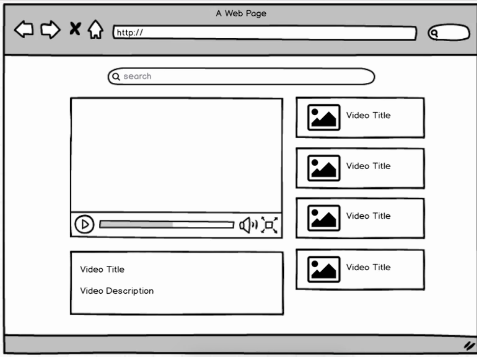

# Video Search APP - Learning React and Redux
### I am following Stephen Grider's course on [Udemy](https://www.udemy.com/react-redux/learn/v4/overview)

 

Starting out:
> I must separate this into compoents and create a skeleton. It is easy to see 3 or 4 basic components: Seach bar, video list, video and detail. We must also use an API. We will use the  
[Youtube API](https://console.developers.google.com/apis/api/youtube/overview)

 Before writing a compoent: I should ask:  Do I expect this component to need to maintain any type of state?
  

The difference between a class-based and functional component?
* A class is used whenever we want to use 'state'
  + state is set within the constructor
  + states are component level.
  + when ever state changes component and childredn are rerendered
* Function is for simple properties, nothing changes.
  + super fast and easy to get going
* callbacks are a bit confusing. Redux can come to the rescue.

## components:
* search_bar
* video_detail
* video_list
* video_list_item
* and index.js to hold the parent 'App' React component.

#### SearchBar
This will need a search term, so that is a good reason to make this a class with a state.

#### VideoDetail
-its a youtube embed
-we only care about the: title, description and url
-all properties of props from App component.
- No state needed! So just a functional component.

- this issue with: videoId from undefined
-- React likes to load components quickly so we need a check
-- if(!video) { return 
Loading...
 }

#### VideoList

#### VideoListItem

### App / index

##### states
* videos
* selectedVideo
  + links clicked from a child component can communicate with App.
  + pass a callback from App to VideoList
  + and from VideoList to VideoListItem

The selectedVideo is set to null and VideoDetail is send a reference. Problem is, at the time of render,
